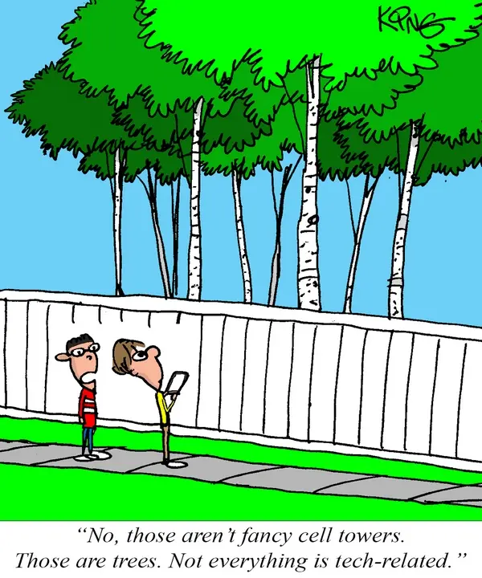
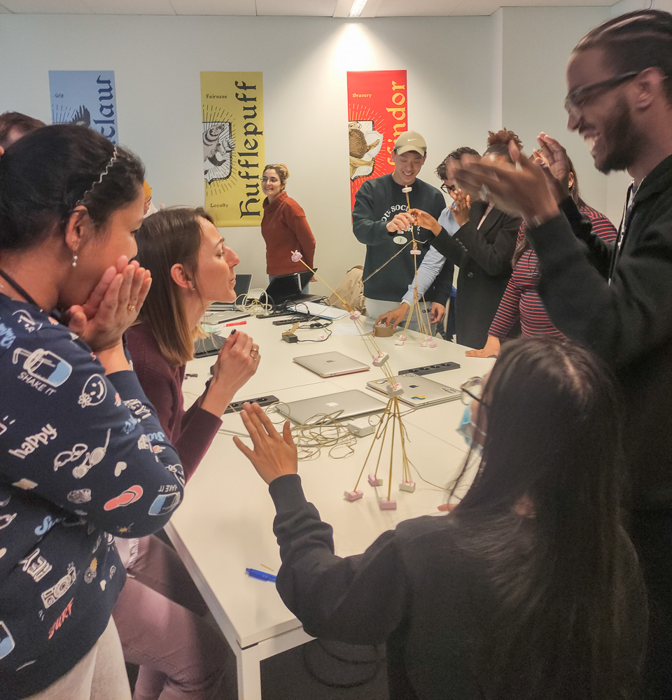

# All About Trees :deciduous_tree: :cherry_blossom:

> The goal of **The Group First** team project is to rebuild the All About Trees
> home page in a new repository.  
> While our main focus is on using`Agile development` and the practicing
> `planning and collaboration` throughout the project we have also decided to
> enhance the given web page in order to make it pretty.

## Table of contents

- [All About Trees :deciduous_tree: :cherry_blossom:](#all-about-trees-deciduous_tree-cherry_blossom)
  - [Table of contents](#table-of-contents)
  - [Team-members](#team-members)
  - [General info](#general-info)
  - [Screenshots](#screenshots)
  - [Technologies](#technologies)
  - [Setup](#setup)
  - [Code Examples](#code-examples)
  - [Features](#features)
  - [Status](#status)
  - [Our style of working together](#our-style-of-working-together)
  - [Contact](#contact)

  - [Table of contents](#table-of-contents)
  - [Team-members](#team-members)
  - [General info](#general-info)
  - [Screenshots](#screenshots)
  - [Technologies](#technologies)
  - [Setup](#setup)
  - [Code Examples](#code-examples)
  - [Features](#features)
  - [Status](#status)
  - [Our style of working together](#our-style-of-working-together)
  - [Contact](#contact)

  - [Table of contents](#table-of-contents)
  - [Team-members](#team-members)
  - [General info](#general-info)
  - [Screenshots](#screenshots)
  - [Technologies](#technologies)
  - [Setup](#setup)
  - [Code Examples](#code-examples)
  - [Features](#features)
  - [Status](#status)
  - [Our style of working together](#our-style-of-working-together)
  - [Contact](#contact)

  - [Table of contents](#table-of-contents)
  - [Team members](#team-members)
  - [General info](#general-info)
  - [Screenshots](#screenshots)
  - [Technologies](#technologies)
  - [Setup](#setup)
  - [Code Examples](#code-examples)
  - [Features](#features)
  - [Status](#status)
  - [Inspiration](#inspiration)
  - [Contact](#contact)

## Team-members

- [MMikhailova](https://github.com/MMikhailova)
- [Carsiti](https://github.com/Carsiti)
- [Zerubabel4](https://github.com/Zerubabel4)
- [minjupgeorge](https://github.com/minjupgeorge)

## General info

A simple website build using `CSS` and `HTML` , the goal is learning development
strategy and project management.

## Screenshots



## Technologies

- HTML
- CSS
- VS code

## Setup

open index.html in your browser and enjoy!

## Code Examples

```html
<!DOCTYPE html>
<html lang="en">
  <head>
    <meta charset="UTF-8" />
    <link rel="icon" type="image/svg+xml" href="./client/assets/favicon.ico" />
    <meta name="viewport" content="width=device-width, initial-scale=1.0" />
    <title>project!</title>

    <link href="./styles/index.css" rel="stylesheet" />
  </head>
  <body>
    <!-- Header section on the top of the page -->
    <header class="centered-items">
      <!-- Images  -->
      
      <!-- Title  -->
      <h1>All About Trees</h1>
      <!-- Images  -->
      
    </header>
    <!-- navigation section on the top of the page -->
    <nav class="bottom-divider">
      <div class="spaced-items">
        <a href="#summary-info">Introduction</a>
        <a href="#main-info">content</a>
        <a href="#extra-info">extras</a>
      </div>
    </nav>
  </body>
</html>
```

## Features

List of features ready and TODOs for future development

- Title
- Navigation links
- Main text
- Images
- Footer

To-do list:

-
-

## Status

Project is: _in progress_

## Our style of working together



## Contact

By [@HYF-team](https://github.com/lab-brussels-1/)
